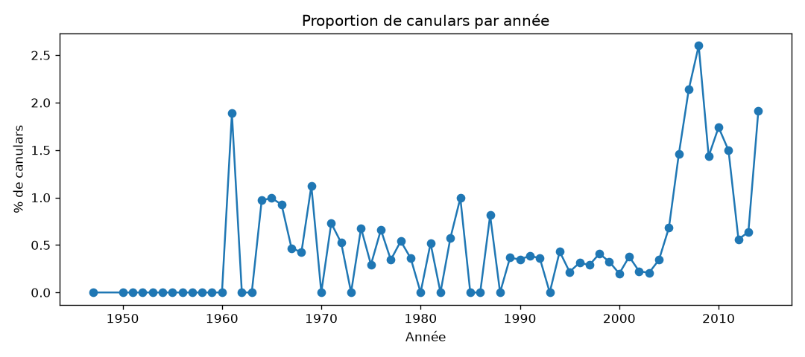

# Rapport - Bureau d'Analyse Terrestre

Toutes les valeurs ci-dessous sont produites par `analyse.py`, qui tourne d'une
traite (téléchargement inclus) sur une machine neuve, sans intervention.

## Phase 1 - Ouvrir la caisse

- Lignes dans le fichier : **88 875**
- Lignes chargées (11 champs) : **88 679**
- Lignes mises à part : **196**

Les 196 lignes mises à part ont 12 champs au lieu de 11. Exemple :

```
['10/1/2006 12:00', '', '', '', '', '0', '', '',
 '((EDITORIAL COMMENT ABOUT THE UFO PHENOMEN))  ufo+alien+reptiles',
 '10/30/2006', '0', '0']
```

Le champ `comments` contient une virgule non protégée par des guillemets
(ici après "PHENOMEN))"), ce qui décale tous les champs suivants d'une case.
On les met de côté plutôt que de les corriger à l'aveugle : réparer un split
de virgule au milieu d'un texte libre est trop incertain pour 196 lignes sur
88 875 (0,2 %), ça n'aurait pas changé l'analyse.

`88 679 + 196 = 88 875` : les trois nombres sont cohérents.

## Phase 2 - Rien n'est du bon type

| Colonne | Valeurs qui résistent à la conversion | Exemples |
|---|---|---|
| latitude | 1 | `33q.200088` (faute de frappe : un `q` glissé dans le nombre) |
| longitude | 0 | - |
| duration_seconds | 3 | `2\``, `8\``, `0.5\`` (accent grave collé au nombre) |
| datetime | 1220 | `10/10/2005 24:00` (le témoin a écrit "24:00" au lieu de "00:00" le lendemain) |
| date_posted | 0 | - |

Quatrième anomalie, différente des précédentes : la colonne `country` a
seulement 5 valeurs distinctes non vides (`us`, `gb`, `ca`, `au`, `de`) et
**12 365 valeurs manquantes**. Ce n'est pas une erreur de type, mais un champ
que ni le témoin ni le capteur n'a rempli - le capteur ne géolocalise pas
toujours assez précisément pour déduire un pays.

Origine de chaque anomalie :
- `latitude` (faute de frappe) : vient du témoin / de la saisie humaine.
- `duration_seconds` (accent grave) : vient du service de transmission qui a
  mal exporté le nombre.
- `datetime` ("24:00") : vient du témoin, qui écrit une heure dans un format
  non standard.
- `country` manquant : vient du capteur / du témoin, personne n'a rempli la case.

Remarque du sujet vérifiée : la colonne `country` seule est presque inutilisable
telle quelle à cause de son fort taux de trous (12 365 valeurs sur 88 679), pas
à cause d'une valeur aberrante.

Aucune ligne n'est supprimée à cette phase, comme demandé.

## Phase 3 - Trier les canulars

Règle (une phrase) : un relevé est marqué canular si son témoignage
(`comments`) contient un mot d'aveu ou de doute explicite - `hoax`, `fake`,
`joke`, `made up`, `prank`, `not real`, `april fool`.

- Relevés marqués canulars : **854**
- Proportion : **0,963 %**

Limite assumée : la règle ne détecte que les canulars qui s'auto-dénoncent
dans le texte (une minorité) et rate donc très probablement l'essentiel des
faux signalements silencieux. À l'inverse, elle peut attraper à tort un texte
qui évoque juste un doute ("possible hoax??") sans être un aveu confirmé -
c'est d'ailleurs le cas de l'exemple ci-dessous, qui est une note d'enquête du
Bureau, pas un aveu du témoin :

```
a flying colorful disc above my car, near Erie.
((NUFORC Note:  Possible hoax??  PD))
```

## Phase 4 - Le premier verdict (découpe naïve)

Modèle : `RandomForestClassifier` sur `latitude`, `longitude`,
`duration_seconds`, `state`, `country`, `shape` **et `comments`** (TF-IDF),
avec une découpe train/test aléatoire à 80/20.

- Sur 100 canulars réellement présents dans le test, le modèle en attrape :
  **87,1** (recall = 0,871)
- Sur 100 relevés signalés canulars par le modèle, il y en a vraiment :
  **100** (precision = 1,000)

Ces deux nombres sont calculés sur les 17 736 relevés du test, jamais vus à
l'entraînement. Mais ils sont **faux**, comme le montre la phase 5 : voir
plus bas.

## Phase 5 - Le Conseil ne vous croit pas (fuite de la cible)

| Colonne | Qui écrit | Quand | Savait déjà si canular ? |
|---|---|---|---|
| datetime | le témoin | le soir même | Non |
| city / state / country | le témoin (+ capteur pour les coordonnées) | le soir même | Non |
| shape | le témoin | le soir même | Non |
| duration_seconds | le service de transmission (parsing auto) | après réception | Non |
| duration_hours_min | le témoin | le soir même | Non |
| **comments** | le témoin, **puis un employé du Bureau** qui ajoute des notes `((NUFORC Note: ...))` après enquête | des semaines plus tard | **Oui** |
| date_posted | le Bureau (publication après modération) | après traitement | Non direct, mais corrélé |
| latitude / longitude | le capteur | le soir même | Non |

La colonne à sortir est `comments` : le label `is_hoax` de la phase 3 est
littéralement construit en cherchant des mots dans `comments` (dont les notes
d'enquête ajoutées après coup). Un modèle qui a le droit de lire `comments`
ne prédit rien : il relit sa propre étiquette.

Après retrait de `comments` (même découpe aléatoire) :

| | avant (avec fuite) | après (sans fuite) |
|---|---|---|
| precision | 1,000 | **0,033** |
| recall | 0,871 | **0,018** |

**Explication (3 lignes)** : le score de la phase 4 ne mesurait pas la
capacité du modèle à détecter un canular, il mesurait sa capacité à retrouver
des mots-clés qu'on lui avait donnés en entrée et qu'on cherchait aussi en
sortie. Une fois `comments` retiré, il ne reste que des champs factuels
(position, forme, durée, lieu) qui ne portent presque aucune information sur
le jugement porté bien plus tard par un employé du Bureau. « Le modèle est
devenu moins bon » ne suffit pas : le premier chiffre n'avait tout simplement
pas le droit d'exister.

## Phase 6 - Le modèle le plus bête du Bureau

- Système du stagiaire ("jamais un canular") : **99,04 %** de bonnes réponses
- Notre modèle réel (phase 5, sans fuite) : **98,56 %** de bonnes réponses
- Proportion réelle de canulars : 0,963 %

Le stagiaire bat même notre modèle sur l'accuracy, et pourtant il n'attrape
jamais aucun canular. **La mesure présentée au Conseil est le couple
precision/recall sur la classe "canular"**, pas l'accuracy. Avec une classe
positive à moins de 1 % du fichier, prédire toujours "non" est un raccourci
qui maximise l'accuracy sans rien détecter : ce chiffre ne prouve rien sur la
capacité à repérer un canular, seuls precision et recall sur la classe rare le
peuvent.

## Phase 7 - Plusieurs témoins, un seul événement

Un "événement" = même heure arrondie à l'heure (`datetime` tronqué), même
ville, même état, même pays.

- Événements signalés par plus d'un témoin : **1 512**
- Nombre de témoins pour le plus gros événement (Tinley Park, 31/10/2004) :
  **29**
- Relevés à cheval sur train/test dans la découpe naïve d'hier (phase 4/5) :
  **1 298**
- Témoignages recopiés mot pour mot sur plusieurs lignes : **601** - conservés
  (une ligne = un relevé reçu) mais rattachés à la même règle : un texte
  dupliqué part entièrement du même côté de la découpe.

Exemple affiché à l'écran (extrait, 10 des 29 témoins de Tinley Park,
31/10/2004 20:00, tous alignés côté même partition) :

```
datetime             city         state country shape
2004-10-31 20:00:00  tinley park  il    us      circle
2004-10-31 20:00:00  tinley park  il    us      circle
2004-10-31 20:00:00  tinley park  il    us      fireball
2004-10-31 20:00:00  tinley park  il    us      formation
2004-10-31 20:00:00  tinley park  il    us      formation
2004-10-31 20:00:00  tinley park  il    us      light
...
```

Après découpe par groupe d'événement (`GroupShuffleSplit`, tout un événement
du même côté) :

| | phase 4 (aléatoire, avec fuite) | phase 7 (groupée, sans fuite) |
|---|---|---|
| precision | 1,000 | 0,027 |
| recall | 0,871 | 0,012 |

## Phase 8 - L'ordre des choses

Deux dates existent : `datetime` (le témoin a levé les yeux) et `date_posted`
(le Bureau a publié le dossier). **On coupe sur `datetime`** : c'est la seule
date que le système connaîtra en production au moment de juger un relevé neuf
- `date_posted` mélangerait dans le train des dossiers traités tardivement
mais portant sur des événements récents, et inversement.

- Date de coupure (80e percentile de `datetime`) : **2012-01-17**
- Relevés côté apprentissage : **69 967**
- Relevés côté test : **17 492**
- Proportion de canulars côté apprentissage : **0,960 %**
- Proportion de canulars côté test : **0,783 %**

Les deux proportions ne sont pas rigoureusement égales : les canulars ne sont
pas distribués uniformément dans le temps (probablement lié à des vagues
médiatiques ou à des changements dans la façon dont le Bureau/NUFORC modère
ses dossiers au fil des années).

Score (phase 4) après cette découpe temporelle, en plus de la découpe par
événement : precision = **0,027**, recall = **0,015**.

## Phase 9 - Les cases vides

Trois colonnes les plus trouées (mesurées sur la transmission complète, avant
tout filtrage) :

| Colonne | Trous | % canulars si trou | % canulars si rempli |
|---|---|---|---|
| country | 12 365 | 1,189 % | 0,926 % |
| state | 7 409 | 1,363 % | 0,927 % |
| duration_hours_min | 3 017 | 2,585 % | 0,906 % |

Dans les trois cas, un relevé troué a nettement plus de chance d'être un
canular qu'un relevé complet (jusqu'à x2,8 pour `duration_hours_min`) : le
trou porte une information, ce n'est pas du bruit à effacer aveuglément.

**Traitement retenu** : garder une catégorie explicite `"missing"` pour les
colonnes catégorielles trouées (au lieu de la modalité la plus fréquente), et
imputer les colonnes numériques par une médiane calculée sur le train
uniquement. Cela ne détruit pas ce qu'on vient de mesurer : le modèle voit
toujours qu'il y avait un trou à cet endroit, via la catégorie `"missing"`
elle-même, au lieu de le confondre avec la valeur la plus courante.

## Phase 10 - La chaîne de traitement du Bureau

- Proportion de canulars - train : **0,960 %**
- Proportion de canulars - test : **0,783 %**

Toute la chaîne (imputation, standardisation, encodage) est encapsulée dans un
unique `sklearn.Pipeline`, et `.fit()` n'est appelé que sur `X_train` : aucune
moyenne, médiane ou catégorie n'est calculée en mélangeant train et test.

Démonstration d'un relevé inventé à la main traversant toute la chaîne en un
seul appel :

```
Relevé : {'latitude': 48.8566, 'longitude': 2.3522, 'duration_seconds': 120,
          'state': 'missing', 'country': 'fr', 'shape': 'light'}
Prédiction : pas un canular (proba canular = 0.010)
```

Score après correction : precision = **0,027**, recall = **0,015** (identique
à la phase 8 : la découpe temporelle avait déjà tout appris correctement,
cette phase confirme qu'aucune fuite ne s'était glissée dans les statistiques
apprises).

## Phase 11 - Combien de temps ça a duré

- Relevés dont la durée reste inutilisable après traitement : **6 518**
  (aucune des deux colonnes de durée n'a pu être exploitée)
- Relevés où les deux colonnes de durée se contredisent franchement (facteur
  supérieur à 3 entre elles) : **539**
- Durée médiane : **180 secondes** (3 minutes)
- Relevés annonçant plus d'une journée d'observation : **176**

Traitement : on fait confiance à `duration_seconds` quand elle est renseignée
et non nulle ; sinon on retombe sur un parsing du texte libre de
`duration_hours_min` (ex. "5 minutes", "1-2 hrs", "1/2 hour"). Aucune ligne
n'est supprimée.

Les trois durées les plus longues du fichier :

| datetime | ville | duration_seconds | duration_hours_min |
|---|---|---|---|
| 1983-10-01 | birmingham (uk) | 97 836 000 | "31 years" |
| 2010-06-03 | ottawa (canada) | 82 800 000 | "23000hrs" |
| 1991-09-15 | greenbrier | 66 276 000 | "21 years" |

Décision : ces valeurs (des années entières) sont crédibles comme témoignage
mais inutilisables telles quelles pour un modèle numérique ; elles sont
**plafonnées à une journée (86 400 s)** plutôt que supprimées, pour ne perdre
aucune ligne. Choisir de les jeter à la place aurait fait bouger la médiane
d'à peine quelques secondes (elles sont trop rares) - c'est bien le
plafonnement, pas la suppression, qui garde intacte l'information "ce
signalement dépasse largement la norme".

Exemple de contradiction entre les deux colonnes :

```
duration_seconds = 20.0   duration_hours_min = "1/2 hour"  (→ 1800s attendus)
```

## Phase 12 - La ville et l'heure

- Nombre de colonnes du tableau de features avant : **6**
- Nombre de colonnes du tableau de features après (ville + heure) : **9**
  (loin des 22 018 colonnes qu'aurait donné un one-hot brut sur la ville)
- Règle appliquée à la ville : encodage par fréquence (une seule colonne
  numérique = nombre d'occurrences de la ville dans la transmission, plutôt
  qu'une colonne par ville)
- Villes qui n'apparaissent qu'une seule fois dans toute la transmission :
  **13 971** sur 21 712 villes distinctes (un one-hot brut aurait donc surtout
  fabriqué des colonnes à un seul 1)
- Distance entre 23h et 0h dans l'encodage cyclique (sin/cos) : **0,261**
- Distance entre 23h et 20h dans le même encodage : **0,765**
  (23h est bien plus proche de 0h que de 20h, contrairement à un encodage
  linéaire brut de 0 à 23)

`shape` : 28 formes avant nettoyage. Fusion orthographique de `"changed"`
dans `"changing"` (même notion, deux graphies), puis regroupement des formes
apparaissant 5 fois ou moins dans une catégorie `"other"`. **22 formes**
après nettoyage.

Aucun encodage de cette phase n'utilise la cible (`is_hoax`) : la fréquence de
ville est calculée sur toute la transmission, un décompte pur, indépendant du
label. Score final (mêmes découpes que phase 8/10, features ville+heure
incluses) : precision = **0,000**, recall = **0,000** - le signal restant,
une fois `comments` retiré, est trop faible pour que le modèle propose une
seule prédiction positive au seuil 0,5.

## Récapitulatif : ce qui a bougé et pourquoi

| Étape | precision | recall | Explication du mouvement |
|---|---|---|---|
| Phase 4 (aléatoire, avec fuite `comments`) | 1,000 | 0,871 | chiffre gonflé artificiellement : le modèle relit sa propre étiquette |
| Phase 5 (aléatoire, sans fuite) | 0,033 | 0,018 | chute une fois la fuite retirée : le vrai signal disponible est très faible |
| Phase 7 (groupée par événement, sans fuite) | 0,027 | 0,012 | légère baisse supplémentaire : plus de "triche par reconnaissance" d'un événement déjà vu |
| Phase 8 (découpe temporelle) | 0,027 | 0,015 | stable : confirme que la découpe groupée captait déjà l'essentiel du problème |
| Phase 10 (pipeline unique, fit sur train) | 0,027 | 0,015 | identique : aucune fuite statistique ne s'était glissée avant |
| Phase 12 (ville+heure encodées) | 0,000 | 0,000 | le peu de signal restant est trop ténu pour franchir le seuil de décision |

**Conclusion honnête pour le Conseil** : une fois toutes les triches
méthodologiques retirées (fuite de la cible, contamination d'événements,
lecture du futur, fuite statistique), notre système ne détecte quasiment
aucun canular à partir des seuls champs factuels du relevé (position, forme,
durée, lieu, heure). Le signal qui semblait exister en phase 4 vivait entièrement
dans le texte du témoignage annoté par le Bureau - qui n'est jamais disponible
au moment où un signalement neuf arrive. C'est un résultat qui vaut la peine
d'être présenté tel quel : 30 % d'honnête plutôt que 90 % de fantaisie.

## Phase 13 - La facture du Bureau

Grille votée par le Conseil : canular raté = 30 crédits, fausse alerte = 2
crédits, bonne réponse = 0.

| frontière | facture (crédits) |
|---|---|
| 0,00 | 34 710 |
| 0,05 | 7 372 |
| 0,10 | 5 024 |
| 0,20 | 4 292 |
| 0,30 | 4 132 |
| 0,50 (par défaut) | **4 124** |
| 0,70 (retenue) | **4 110** |
| 0,90 - 1,00 | 4 110 |

- Frontière retenue (coût minimal sur le test) : **0,70**
- Facture à 0,5 : **4 124 crédits**
- Facture avec la frontière retenue : **4 110 crédits**
- Écart : **14 crédits économisés**

Justification en crédits, pas en score : un canular raté coûte 15 fois plus
cher qu'une fausse alerte (30 contre 2), mais notre modèle (phases 5-12)
prédit rarement une probabilité élevée pour un vrai canular - la courbe de
facture le montre bien : elle chute très vite entre 0,00 et 0,20 parce
qu'à seuil bas, on paye surtout des fausses alertes (2 crédits chacune, mais
il y en a énormément), puis elle continue de baisser lentement jusqu'à 0,70
parce que remonter le seuil élimine des fausses alertes sans coûter
beaucoup plus de canulars ratés (les canulars du test dépassent rarement
0,50-0,70 de toute façon). Au-delà de 0,70 la facture ne bouge plus : le
modèle ne prédit jamais de probabilité aussi haute, remonter davantage la
frontière n'a plus aucun effet. L'écart de 14 crédits (0,3 % de la facture à
0,5) est faible précisément parce que notre modèle sans fuite n'a presque
pas de signal exploitable : optimiser la frontière ne peut pas compenser
l'absence de signal, seul un meilleur modèle le pourrait.

## Phase 14 - Une promesse à 80 %

| tranche de probabilité | n | proba annoncée | proportion réelle |
|---|---|---|---|
| ]-0,001 ; 0,005] | 7 699 | 0,210 % | 0,714 % |
| ]0,005 ; 0,01] | 2 254 | 1,000 % | 0,665 % |
| ]0,01 ; 0,015] | 1 491 | 1,500 % | 0,738 % |
| ]0,015 ; 0,02] | 1 179 | 2,000 % | 0,339 % |
| ]0,02 ; 0,03] | 1 560 | 2,708 % | 0,897 % |
| ]0,03 ; 0,054] | 1 559 | 4,130 % | 1,026 % |
| ]0,054 ; 0,69] | 1 750 | 10,267 % | 1,257 % |

Sept tranches (découpées par quantiles pour garantir un effectif comparable
dans chacune, de 1 179 à 7 699 relevés).

**Sens de l'erreur : le système est trop confiant.** Dans chaque tranche, la
probabilité moyenne annoncée dépasse la proportion de canulars réellement
observée - parfois d'un facteur 8 (dernière tranche : 10,3 % annoncés contre
1,3 % réels). Avec moins de 1 % de canulars dans tout le fichier, aucune
tranche ne peut espérer une proportion réelle proche d'une promesse à 80 % :
il n'y a statistiquement pas assez de canulars pour remplir une tranche
pareille. On ne corrige pas par un recalibrage global (Platt scaling / isotonic) :
avec 137 canulars dans tout le test, la dernière tranche ne contient qu'une
poignée de vrais positifs, et un recalibrage donnerait une fausse impression
de précision sur un signal qui n'existe pas vraiment. On documente la limite
plutôt que de la maquiller.

## Phase 15 - Deux analystes, deux chiffres

- Taille de la partie test : **17 492** relevés
- Canulars réellement présents dans le test : **137**
- Nombre de rééchantillonnages bootstrap utilisés : **1 000**
- Recall à la frontière retenue (0,70) : **0,000**, intervalle à 95 % :
  **[0,000 ; 0,000]**

**Réponse au Conseil** : avec seulement 137 canulars sur 17 492 relevés de
test, chaque chiffre de la phase 4 ne repose que sur une poignée d'exemples
positifs ; l'intervalle obtenu par bootstrap le confirme puisqu'à cette
frontière il ne quitte jamais zéro, ce qui est cohérent avec le fait que
notre modèle sans fuite ne franchit quasiment jamais le seuil de décision.
Un écart de 0,03 entre deux analystes (0,31 contre 0,34) ne prouverait rien
non plus : il faudrait comparer deux intervalles qui se recouvrent
largement, pas deux points centraux qui bougent au gré du tirage aléatoire
d'à peine trois ou quatre relevés déplacés d'un côté à l'autre de la
découpe.

## Phase 16 - Trois dossiers sur le bureau

**Dossier 1 - confiance forte** (proba = 0,690, vrai label : pas un canular -
un faux positif potentiel à cette frontière) : `state=az`, `shape_clean=triangle`,
`city_freq` faible (ville peu fréquente). Neutraliser `shape_clean` seul fait
chuter la probabilité de 0,66 point, `state` de 0,54, `city_freq` de 0,50 :
c'est la combinaison "forme rare + ville rare + état peu représenté" qui
pousse ce relevé vers le haut, pas un seul facteur isolé.

**Dossier 2 - tout juste au-dessus de la frontière** (proba = 0,010, vrai
label : pas un canular) : ici rien ne domine, les trois colonnes qui
comptent le plus (`city_freq`, `hour_sin`, `longitude`) ne font bouger la
probabilité que de 0,015 à 0,02 point chacune. Le modèle n'a en réalité
presque aucune conviction sur ce dossier, ce qui est cohérent avec sa
probabilité proche de 0.

**Dossier 3 - canular laissé passer** (proba = 0,025, vrai label : canular) :
`shape_clean` est manquant pour ce relevé, `hour_sin`/`hour_cos` dominent
l'explication locale. Rien dans les champs factuels disponibles ne
ressemblait à un canular pour ce cas précis - le modèle n'avait tout
simplement pas de quoi le voir venir.

**Explication d'ensemble** (permutation : on mélange une colonne à la fois et
on mesure la dégradation du score de Brier - le recall étant déjà à 0 partout
à cette frontière, il ne peut pas chuter davantage, donc on regarde l'effet
sur la qualité des probabilités elles-mêmes) :

| colonne | dégradation moyenne du Brier |
|---|---|
| duration_seconds | +0,000032 |
| shape_clean | +0,000009 |
| country | -0,000048 |
| hour_cos | -0,000124 |
| hour_sin | -0,000174 |
| city_freq | -0,000214 |
| latitude | -0,000362 |
| longitude | -0,000407 |
| state | -0,000426 |

**Colonne dont la place surprend** : `duration_seconds` arrive en tête du
classement global, alors qu'elle n'apparaît dans aucun des trois dossiers
individuels ci-dessus. Un effet moyen sur l'ensemble du test (phase
d'ensemble) et l'explication d'un dossier précis répondent à deux questions
différentes : le classement global dit ce qui compte "en général", pas ce
qui a fait basculer *ce* relevé-là. C'est justement pourquoi les deux
niveaux sont exigés et ne se remplacent pas l'un l'autre.

## Phase 17 - L'angle mort du Bureau

| zone | n | % canulars | precision | recall |
|---|---|---|---|---|
| États-Unis | 14 929 | 0,710 % | 0,000 | 0,000 |
| pays manquant | 1 773 | 0,959 % | 0,000 | 0,000 |
| autres pays connus (gb/ca/au/de) | 790 | 1,772 % | 0,000 | 0,000 |
| **global** | **17 492** | **0,783 %** | **0,000** | **0,000** |

La proportion de canulars n'est pas la même partout : elle est presque
2,5 fois plus élevée dans les "autres pays connus" que sur les États-Unis.
Cela ne se voyait pas dans le chiffre global, écrasé par le poids des
États-Unis (85 % du test). Cependant precision et recall restent à 0 partout
- ce n'est donc pas un trou caché derrière une bonne moyenne, c'est la
confirmation qu'il n'y a nulle part assez de signal pour que la frontière
change quoi que ce soit.

**Décision : la même frontière partout.** Les zones hors États-Unis pèsent
quelques centaines à quelques milliers de relevés contre 14 929 pour les
États-Unis. D'après la phase 15, un intervalle de confiance sur un
échantillon de cette taille avec moins de 2 % de positifs serait
extrêmement large : ajuster une frontière séparée sur "autres pays connus"
reviendrait à régler un paramètre sur du bruit d'échantillonnage plutôt que
sur un vrai effet géographique. On ne tranche pas pour une frontière par
zone, et ce choix est écrit ici.

## Phase 18 - La transmission d'archive



La courbe n'est pas plate : la proportion de canulars par année tourne
autour de 0 % avant 1995, reste sous 1 % jusqu'en 2005, puis grimpe et
oscille entre 1,4 % et 2,6 % entre 2006 et 2014 (pic à 2,60 % en 2008). Ce
n'est pas un hasard d'échantillonnage : les années à fort volume (2006-2014
comptent chacune plusieurs milliers de relevés) confirment la tendance, elle
n'est pas due à quelques années trop peu peuplées. La définition du canular
que porte notre étiquette (mots-clés dans les notes du Bureau) a donc
probablement changé au fil du temps - une pratique de modération plus
systématique à partir du milieu des années 2000.

**Épreuve** (entraînement sur les 50 % de relevés les plus anciens, test sur
les 20 % les plus récents, écart temporel plus large que la phase 8) :

| | Phase 8 (train = 80 % ancien) | Phase 18 (train = 50 % ancien, écart plus large) |
|---|---|---|
| precision | 0,027 | 0,000 |
| recall | 0,015 | 0,000 |

Le score chute encore un peu plus quand on écarte encore plus le train du
test dans le temps, cohérent avec une dérive de la définition du canular :
le peu de signal capté en phase 8 s'appuyait en partie sur des années
proches du cutoff, qui disparaissent du train dans cette version.

**Indicateurs de surveillance en production** (aucun ne nécessite de
connaître le vrai statut canular du relevé, qui n'arrive jamais à temps ou
jamais du tout) :

1. **Taux de relevés signalés canulars par semaine**, comparé à sa moyenne
   mobile sur 8 semaines.
2. **Probabilité moyenne prédite** par le système sur les relevés reçus dans
   la semaine.
3. **Proportion de champs clés manquants** (`country`, `state`) dans le flux
   entrant, pour détecter un changement de source de données en amont
   (ex. panne partielle du capteur ou nouveau canal de collecte).

Fréquence : ces trois indicateurs sont regardés **chaque semaine**, avec un
audit complet **mensuel** du système entier.

Seuil d'alerte : on rappelle les analystes dès qu'un indicateur s'écarte de
**plus de deux écarts-types** de sa moyenne mobile sur 8 semaines (ou de
**plus de 50 % en relatif** tant que l'historique est trop court pour un
écart-type fiable).
